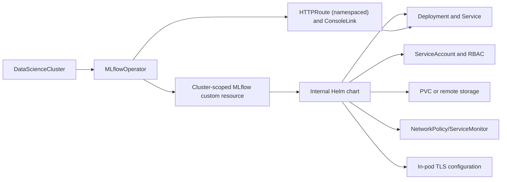

# MLflow Operator Architecture

## Overview

The MLflow Operator is the controller that turns an `MLflow` custom resource into a running MLflow deployment on Kubernetes or OpenShift. In Open Data Hub (ODH), this is the supported deployment method for the shared MLflow service.

The operator does not reimplement MLflow behavior itself. Instead, it configures and deploys MLflow so the runtime can use the Kubernetes-aware extensions from the companion `mlflow` repository:

- `kubernetes://` as the workspace provider
- `kubernetes-auth` as the application plugin for request authorization

This split is intentional:

- The operator owns reconciliation, resource creation, routing, TLS, and deployment wiring.
- The MLflow runtime owns workspace resolution, authorization, API handling, and artifact-root selection at request time.

## Supported ODH Deployment Method

The ODH path is operator-managed and platform-integrated:

1. `DataScienceCluster` enables the MLflow Operator.
2. The operator watches cluster-scoped `MLflow` resources in `mlflow.opendatahub.io/v1`.
3. For each `MLflow` resource, the operator renders its internal Helm chart into Kubernetes resources.
4. The resulting MLflow deployment is exposed through the platform gateway under `/mlflow`.

## Reconciliation Diagram

This diagram stops at the resources the operator reconciles. The MLflow runtime topology and plugin behavior are described in the companion MLflow [ARCHITECTURE.md](https://github.com/opendatahub-io/mlflow/blob/master/ARCHITECTURE.md).

## Reconciliation Model

### Input Custom Resources

The operator's primary input is the cluster-scoped `MLflow` CR in the `mlflow.opendatahub.io` API group.

The CRD currently enforces `metadata.name: mlflow`, which means the supported deployment model is one shared instance rather than multiple independently named MLflow installations.

That CR supplies the deployment-level settings for the shared MLflow service, including runtime, storage, networking, and security configuration. For the full schema, refer to the `MLflow` CRD.

The architecture also includes the namespace-scoped `MLflowConfig` resource from `mlflow.kubeflow.org`, but that resource is consumed at MLflow runtime by the workspace provider rather than by the controller when reconciling the main server deployment.

### Rendering Strategy

The operator uses an internal Helm chart as its deployment template. This gives the project one deployment shape that can be:

- installed directly with Helm
- rendered by the operator during reconciliation
- adapted for ODH and downstream overlays

The rendered deployment starts MLflow with the key runtime flags that enable the Kubernetes integration:

- `--app-name=kubernetes-auth`
- `--enable-workspaces`
- `--workspace-store-uri=kubernetes://`

It also sets `MLFLOW_K8S_AUTH_AUTHORIZATION_MODE=self_subject_access_review` so the deployed MLflow server authorizes requests with the caller's token rather than a separate MLflow-specific permission system.

## Traffic and Exposure

### External Entry Point

For OpenShift and ODH deployments, the operator integrates MLflow with the platform gateway and application menu:

- A `ConsoleLink` named after the MLflow resource exposes an `MLflow` application-menu entry.
- The link target is built from the configured `MLFLOW_URL` plus the resource name.
- An `HTTPRoute` points traffic at the namespaced MLflow service on port `8443`.

### Path Layout

The route model is designed around a public `/mlflow` prefix:

- `/mlflow` forwards to the MLflow service as-is
- `/mlflow/api` is rewritten to `/api`
- `/mlflow/v1` is rewritten to `/v1`

This lets the service keep its normal internal API paths while still fitting behind a stable product-facing prefix.

### TLS Model

TLS terminates inside the MLflow pod. The chart passes uvicorn SSL options and mounts a secret named `mlflow-tls`.

On OpenShift, that secret can be provisioned automatically through the service-ca integration. In non-OpenShift environments, the deployment can supply the secret directly.

## Storage and Availability Decisions

The `MLflow` CR controls whether the deployment uses local PVC-backed storage or remote database and artifact backends. The operator is responsible for wiring that storage into the deployment, while the MLflow runtime still decides which artifact root applies to a specific workspace.
