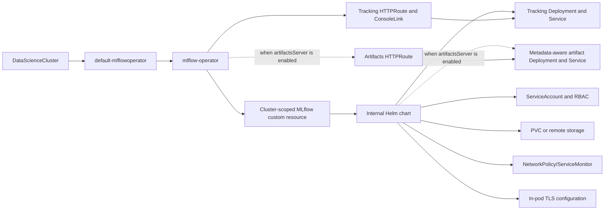
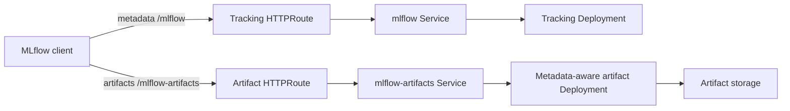
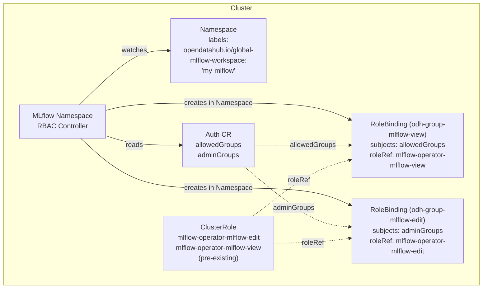

# MLflow Operator Architecture

## Overview

The MLflow Operator is the controller that turns an `MLflow` custom resource into a running MLflow deployment on Kubernetes or OpenShift. In Open Data Hub (ODH), this is the supported deployment method for the shared MLflow service.

The operator does not reimplement MLflow behavior itself. Instead, it configures and deploys MLflow so the runtime can use the Kubernetes-aware extensions from the companion `mlflow` repository:

- `kubernetes://` as the workspace provider
- `kubernetes-auth` as the application plugin for request authorization

This split is intentional:

- The operator owns reconciliation, resource creation, routing, TLS, and deployment wiring.
- The MLflow runtime owns workspace resolution, authorization, API handling, and artifact-root selection at request time.

## Supported ODH Deployment Method

The ODH path is operator-managed and platform-integrated:

1. `DataScienceCluster` enables the MLflow Operator.
2. ODH deploys `mlflow-operator`, and during the modular handoff it can also create the singleton cluster-scoped `MLflowOperator` module CR in `components.platform.opendatahub.io/v1alpha1`.
3. The operator watches cluster-scoped `MLflow` resources in `mlflow.opendatahub.io/v1`.
4. For each `MLflow` resource, the operator renders its internal Helm chart into Kubernetes resources.
5. The resulting MLflow deployment is exposed through the platform gateway under `/mlflow`.

The new `MLflowOperator` controller path is intentionally rollout-gated behind `ENABLE_MLFLOW_OPERATOR_MODULE_CONTROLLER` so releases can carry the API/controller implementation before ODH switches over to the module framework.

## Reconciliation Diagram

```mermaid
flowchart LR
  dsc[DataScienceCluster] --> moduleCr["default-mlflowoperator"]
  moduleCr --> operator[mlflow-operator]
  operator --> mlflowCr["Cluster-scoped MLflow custom resource"]
  mlflowCr --> chart["Internal Helm chart"]

  chart --> deploy["Tracking Deployment and Service"]
  chart -. "when artifactsServer is enabled" .-> artifactDeploy["Metadata-aware artifact Deployment and Service"]
  chart --> access["ServiceAccount and RBAC"]
  chart --> storage["PVC or remote storage"]
  chart --> policy["NetworkPolicy/ServiceMonitor"]
  chart --> tls["In-pod TLS configuration"]

  operator --> route["Tracking HTTPRoute and ConsoleLink"]
  operator -. "when artifactsServer is enabled" .-> artifactRoute["Artifacts HTTPRoute"]
  route --> deploy
  artifactRoute --> artifactDeploy
```

This diagram stops at the resources the operator reconciles. The MLflow runtime topology and plugin behavior are described in the companion MLflow [ARCHITECTURE.md](https://github.com/opendatahub-io/mlflow/blob/master/ARCHITECTURE.md).

## Reconciliation Model

### Input Custom Resources

The operator's primary input is the cluster-scoped `MLflow` CR in the `mlflow.opendatahub.io` API group.

The CRD currently enforces `metadata.name: mlflow`, which means the supported deployment model is one shared instance rather than multiple independently named MLflow installations.

That CR supplies the deployment-level settings for the shared MLflow service, including runtime, storage, networking, and security configuration. For the full schema, refer to the `MLflow` CRD.

The architecture also includes the namespace-scoped `MLflowConfig` resource from `mlflow.kubeflow.org`, but that resource is consumed at MLflow runtime by the workspace provider rather than by the controller when reconciling the main server deployment.

### Rendering Strategy

The operator uses an internal Helm chart as its deployment template. This gives the project one deployment shape that can be:

- installed directly with Helm
- rendered by the operator during reconciliation
- adapted for ODH and downstream overlays

The rendered deployment starts MLflow with the key runtime flags that enable the Kubernetes integration:

- `--app-name=kubernetes-auth`
- `--enable-workspaces`
- `--workspace-store-uri=kubernetes://`

It also sets `MLFLOW_K8S_AUTH_AUTHORIZATION_MODE=self_subject_access_review` so the deployed MLflow server authorizes requests with the caller's token rather than a separate MLflow-specific permission system.

## Traffic and Exposure

### External Entry Point

For OpenShift and ODH deployments, the operator integrates MLflow with the platform gateway and application menu:

- A `ConsoleLink` named after the MLflow resource exposes an `MLflow` application-menu entry.
- The link target is built from the configured external base URL. During the legacy path that comes from `MLFLOW_URL`; during the modular handoff it can be derived from the singleton `MLflowOperator` gateway projection.
- An `HTTPRoute` points traffic at the namespaced MLflow service on port `8443`.

### Path Layout

The route model is designed around a public `/mlflow` prefix:

- `/mlflow` forwards to the MLflow service as-is
- `/mlflow/api` is rewritten to `/api`
- `/mlflow/v1` is rewritten to `/v1`

This lets the service keep its normal internal API paths while still fitting behind a stable product-facing prefix.

When the dedicated artifact server is enabled, the gateway additionally exposes
`/mlflow-artifacts`. Both metadata-connected servers use the full artifact API root at
`/mlflow-artifacts/api/2.0/mlflow-artifacts/artifacts`, so any metadata they create directs artifact
traffic to the second Service without changing the tracking URI. A more-specific compatibility match routes
the legacy `/mlflow/api/2.0/mlflow-artifacts` and `/mlflow/ajax-api/2.0/mlflow-artifacts` proxy
families to the same Service and rewrites them to the dedicated prefix. Artifact transfers,
multipart operations, and presigned downloads for existing `mlflow-artifacts:/` experiment and run
locations therefore remain usable after split serving is enabled without giving the tracking
Deployment artifact storage.
The artifact route also rewrites tracking-relative UI artifact handlers that need metadata lookups.
Run/model-version downloads, artifact list/upload, trace-artifact, and logged-model artifact requests
use the artifact Service; the general `/mlflow` route continues to select tracking. Because Gateway
API cannot portably match the model ID in the middle of logged-model artifact paths, the
`/logged-models/` compatibility prefix also sends non-artifact logged-model requests to the
metadata-aware artifact Deployment.
The garbage-collection CronJob bypasses the external Gateway but follows the same compatibility
model by resolving those locations against the internal artifact Service and static prefix.
Both Services retain the instance `app` label used by the operator cache, while the `ServiceMonitor`
also requires the tracking-only `app.kubernetes.io/component: tracking-server` label because the
artifact server does not enable Prometheus exposition.
The controller verifies that the `HTTPRoute` API is available before cleanup, migration, chart
rendering, or operand application, preventing a missing routing capability from causing a partial
split-server rollout.

```mermaid
flowchart LR
  client[MLflow client] -->|metadata /mlflow| trackingRoute[Tracking HTTPRoute]
  client -->|artifacts /mlflow-artifacts| artifactRoute[Artifact HTTPRoute]
  trackingRoute --> trackingService[mlflow Service]
  trackingService --> trackingDeployment[Tracking Deployment]
  artifactRoute --> artifactService[mlflow-artifacts Service]
  artifactService --> artifactDeployment[Metadata-aware artifact Deployment]
  artifactDeployment --> storage[Artifact storage]
```

Both Deployments use the Kubernetes workspace provider and authorization plugin, connect to the
same metadata stores, and disable server-side job execution. The artifact server validates the
request workspace before MLflow resolves metadata-backed artifact locations. Namespace
`MLflowConfig` artifact-root overrides continue to produce direct storage URIs and therefore do
not traverse the shared artifact route.

Because both Deployments can access metadata, operator-managed migrations render both at zero
replicas and wait for their live replica counts to reach zero before creating a migration Job. A
split Deployment being disabled is quiesced before its cleanup is allowed to proceed.

### TLS Model

TLS terminates inside the MLflow pods. The chart passes uvicorn SSL options and mounts
`mlflow-tls` for the tracking server. The optional artifact server mounts its own
`mlflow-artifacts-tls` Secret so its certificate matches the artifact Service DNS name.

On OpenShift, that secret can be provisioned automatically through the service-ca integration. In non-OpenShift environments, the deployment can supply the secret directly.

## Storage and Availability Decisions

The `MLflow` CR controls whether the deployment uses local PVC-backed storage or remote database and artifact backends. The operator is responsible for wiring that storage into the deployment, while the MLflow runtime still decides which artifact root applies to a specific workspace.

## Namespace RBAC

The main reconciliation loop renders resources through the internal Helm chart for each MLflow CR. The namespace RBAC controller is architecturally distinct: it watches Namespace objects (not MLflow CRs), creates RoleBindings directly (not via Helm), and reads the platform Auth CR through an unstructured client to avoid importing the ODH platform API module.

This controller runs as a separate reconciliation loop gated behind `ENABLE_NAMESPACE_RBAC`. When a namespace carries the `opendatahub.io/global-mlflow-workspace` label, the controller ensures that the Auth CR's user groups are bound to the pre-existing `mlflow-operator-mlflow-view` and `mlflow-operator-mlflow-edit` aggregate ClusterRoles via namespace-scoped RoleBindings.

```mermaid
flowchart TB
    subgraph Cluster
        NS["Namespace\nlabels:\n  opendatahub.io/global-\n  mlflow-workspace:\n  'my-mlflow'"]

        Controller["MLflow Namespace\nRBAC Controller"]

        Auth["Auth CR\nallowedGroups\nadminGroups"]

        CR["ClusterRole\nmlflow-operator-mlflow-edit\nmlflow-operator-mlflow-view\n(pre-existing)"]

        RBView["RoleBinding (odh-group-mlflow-view)\nsubjects: allowedGroups\nroleRef: mlflow-operator-mlflow-view"]

        RBEdit["RoleBinding (odh-group-mlflow-edit)\nsubjects: adminGroups\nroleRef: mlflow-operator-mlflow-edit"]

        Controller -- "watches" --> NS
        Controller -- "reads" --> Auth
        Controller -- "creates in Namespace" --> RBView
        Controller -- "creates in Namespace" --> RBEdit
        Auth -. "allowedGroups" .-> RBView
        Auth -. "adminGroups" .-> RBEdit
        CR -. "roleRef" .-> RBView
        CR -. "roleRef" .-> RBEdit
    end
```

### Watch and lifecycle strategy summary

| Watch object | Watch method | Lifecycle safety net | Rationale |
|---|---|---|---|
| **Namespace** | `For()` (primary) | `metadata.namespace` (K8s built-in: namespace deletion cascades to all contained resources) | Primary reconciliation target; label presence/absence drives create/cleanup |
| **MLflow CR** | `Watches()` + custom mapper | `ownerReference` with `controller: true` (GC cascade) | Owner of the RoleBindings; GC provides a safety net when the operator is offline |
| **Auth CR** | `Watches()` + custom mapper | None (watch + active reconcile only) | External resource from another operator; ownerReference would be ineffective due to multi-owner GC semantics and UID instability |
| **RoleBinding** | `WatchesRawSource()` + dedicated caches + custom mapper | None (it *is* the controlled resource) | Self-healing: detects external tampering or deletion and triggers re-reconciliation. Must use dedicated per-name caches with `metadata.name` field selectors (`odh-group-mlflow-view`, `odh-group-mlflow-edit`) because the operator's RBAC uses `resourceNames`-scoped permissions — a general informer cache without a field selector would be rejected by the API server |
